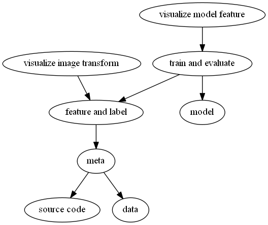

# COVID-CXR-Classification
This project built a pipeline with multiple trained models to classify Chest X-Ray images into Normal/Penumonia/COVID-19. 

## Features
- **DVC pipeline** (with simple CLI for setup and run) to reproduce and version control the whole process
- **Segmentation** and **Adaptive Histogram Equilization** with OpenCV in preprocess
- Over **20,000** CXRs and labels
- **Visualization** of image transformation for clarification
- Trained models including **ResNet**, **VGGNet**, **COVID-Net** with tensorflow and pytorch.
- **Augmentation** in training
- **Grad-CAM Visualization** of model feature for clarification
- **Hyperparameter** tunning for ETL, training, evaluating, models, visualization.


## Environment
Main software packages include:
```
  - conda=4.9.1
  - python=3.6
  - pyspark=3.0.1
  - pytorch=1.3.1
  - tensorflow=2.3.1
  - dvc==1.10.2
  - torchvision=0.4.2
  - scikit-learn
  - numpy
  - scipy
  - pandas
  - matplotlib=3.1.0
  - pydicom
  - opencv
  - ipython
  - notebook
  - jupyter
  - ipykernel
  - pip
```

## Setup
0. Set up Python, Anaconda, Git, a cloned copy of the project
1. Create environment with
```
conda env create -f env.yml
```
2. For Windows OS, build pipeline with
```
setup
```

## Usage
For Windows OS, run pipeline with
```
run
```

## Pipeline
The pipeline is built on DVC ([Data Version Control](https://dvc.org/doc/start)). It caches and versions data flow, constructs a DAG ([directed acyclic graph](https://en.wikipedia.org/wiki/Directed_acyclic_graph)) used to reproduce the whole procedure. The DAG consists of series of ordered stages with dependenceis and outputs including hyperparameter setting. Eeach stage executes an OS-dependant cmd (only support Windows now) which executue a series of numbered main files (.ipynb, .py) located in `./src/main/`, and/or compute a hash file for the pipeline graph. Examples of those main files are displayed in `./main demo/`

### DAG


### Hyperparameters
`params.yaml` is the hyperparameter file to construct pipeline in DVC, and for user to fine-tune the whole process from ETL, model setup to training and visualization.
It fine-tunes:
- ETL: image size, crop area, spark control, segmentation control, adaptive or global histogram equilizaiton, etc.
- Model: model tool (tensorflow/pytorch), model name, model architect (VGG, ResNet, COVID-Net), transfer-learning control, etc.
- Train: epoch, learning rate, batch size, COVID-19 label weights in batch, COVID-19 label weights in optimization, etc.
- Visualization: example number, figure size for both transformation and model feature.

## Data

### Data Source
The current COVIDx dataset is constructed by the following open source chest radiography datasets:
* https://github.com/ieee8023/covid-chestxray-dataset
* https://github.com/agchung/Figure1-COVID-chestxray-dataset
* https://github.com/agchung/Actualmed-COVID-chestxray-dataset
* https://www.kaggle.com/tawsifurrahman/covid19-radiography-database
* https://www.kaggle.com/c/rsna-pneumonia-detection-challenge (which came from: https://nihcc.app.box.com/v/ChestXray-NIHCC)

### Preprocess
Use `PySpark` to do ETL process with image meta. Transform image data including histogram equilization and segmentaiton with `OpenCV` and prepare image data ready for `PyTorch`.
See `./src/etl.py`, `./src/etl_spark.py` for Spark ETL.
See `./src/transform.py` for image pre-training transform.

### Data description:
```python
# total
Counter({'pneumonia': 11092, 'normal': 10340, 'covid': 617})
# test data from covid datasets: 
Counter({2: 2219, 1: 2068, 0: 124})
# train data from covid datasets: 
Counter({2: 8873, 1: 8272, 0: 493})
```

### Demo of Pretraining Transform


## Model
Supported models include `VGG11`, `VGG19`, `ResNet18`, `ResNet50`, `COVID-Net-CXR-A`, `COVID-Net-CXR-Large`, `COVID-Net-CXR-Small`. ResNet and VGGNet are in `PyTorch` and has complete computational model structure with weights. COVID-Net is from https://github.com/lindawangg/COVID-Net, it doesn't have full computational model but meta graph with saved weights checkpoints.

### Trained model and weights
For COVID-Net tensorflow models, access metagraph and checkpoints source from https://github.com/lindawangg/COVID-Net.
For VGGNet, ResNet pytorch models, access saved model from `./model/`

### Demo of Grad-CAM visualization of model features


### Demo of model output metrics
- Learning curve - PPVs

- Learning curve - TPRs

- Learning curve - losses

- Confusion Matrix (horizontally normalized for PPV/Sensitivity/Specivity)


## Train and Evaluate
- Augmentation is applied in training. 
- Due to sample inbalance, batch weights and optimization weights for COVID-19 are balanced according to setup weights from `params.yaml`. 
- For VGGNet, ResNet, you can choose to train from refresh, from downloaded pretrained model with 'torchvision', or from pretrained saved model in `./moodel/`. For COVID-Net, you can choose to train form refresh or from previous checkpoint.

## Iterations
Two iteration of modeling and training results are currently available for ResNet.\
Changes from iter1 to iter2:
- add histogram equilization
- add segmentation
- image shape from 224x224x3 to 480x480x1

## Issues
1. ```ERROR Shell: Failed to locate the winutils binary in the hadoop binary path```\
solve:\
https://github.com/dotnet/spark/issues/61\
https://stackoverflow.com/questions/51922477/running-spark-pyspark-first-time\
2. tensorflow 1.x default builds DO NOT include CPU instructions that fasten matrix computation including avx, avx2, etc,.\
solve:
see explains at https://stackoverflow.com/questions/47068709/your-cpu-supports-instructions-that-this-tensorflow-binary-was-not-compiled-to-u\
see wheel downloads at https://github.com/fo40225/tensorflow-windows-wheel/tree/master/2.1.0/py37/CPU%2BGPU/cuda102cudnn76avx2\
install by 'pip install --ignore-installed --upgrade /path/target.whl'
3. COVID-Net is only a meta graph with saved checkpoints. Unable to visualize its features.

## Todo
- collect new data for test
- CLI with more functionality
- 
